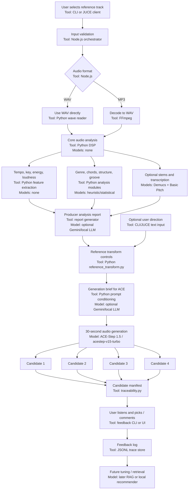

# Reference Track Pipeline

This document explains how the next-track workflow should work: the user gives a reference track, the system analyzes it in detail, the user can add creative direction, ACE-Step generates candidate 30-second samples, and user feedback becomes training data for future tuning.

## Product Goal

Given a reference track, produce:

- A detailed producer-style analysis of the whole track.
- A structured map of the arrangement by time ranges and bars.
- A technical prompt/control package for generation.
- Four candidate 30-second generated samples per similarity level.
- A feedback record showing which candidate the user preferred and why.

The system should not pretend that automatic scoring knows the best candidate. It should expose all candidates and let the user decide.

## High-Level Flow



## Technology and Model Map

| Pipeline Step | Current Tool | Current AI Model | Notes |
|---|---|---|---|
| User input | `scripts/pipelines/run-reference-pipeline.js`, later JUCE UI | None | Accepts reference path, output folder, similarity level, optional direction. |
| Job orchestration | Node.js backend / CLI | None | Owns validation, process calls, logs, job folders, exports. |
| MP3 decoding | FFmpeg | None | Converts MP3 to WAV before Python analysis. |
| Core WAV analysis | Python stdlib WAV reader + local DSP | None | Estimates duration, loudness, energy curve, rough BPM/key. |
| Better BPM/key/groove | Python analysis modules | Mostly heuristic/statistical | Refines tempo, key, groove, genre hints. |
| Chords | Python chord detection, chroma/beat features | None or lightweight DSP | Produces rough chord/progression hints. |
| Structure | Python structure analysis | None or lightweight DSP | Finds energy/section changes; target is bar-aligned arrangement labels. |
| Genre/style | Python genre detection | Heuristic today | Target is producer-grade genre/subgenre classification. |
| Stem separation | Demucs, optional | Demucs | Splits drums/bass/other/vocals when installed. |
| Bass/drum MIDI extraction | Basic Pitch + onset/frequency analysis, optional | Basic Pitch for pitched notes | Useful but imperfect; still needs listening review. |
| Producer report | Planned `analysis-report.md` generator | Optional Gemini 2.0 Flash or local LLM | This is the next missing artifact: detailed human-readable track analysis. |
| SUNO/ACE prompt writing | Current Gemini prompt helper for SUNO; Python prompt conditioning for ACE | Gemini 2.0 Flash optional | Gemini is cloud/optional; local-first path should still work without it. |
| Similarity controls | `analysis/reference/reference_transform.py` | None | Converts `low` through `near-identical` into ACE task type, cover strength, prompt constraints. |
| Audio generation | Local ACE-Step API | ACE-Step 1.5, default `acestep-v15-turbo`, LM `acestep-5Hz-lm-0.6B` | Primary generator for listenable 30-second samples. |
| Audio generation fallback | AudioCraft / MusicGen paths | `facebook/musicgen-melody` or AudioCraft MusicGen when enabled | Experimental fallback; ACE-Step is the preferred path right now. |
| Candidate scoring | Python audio quality + groove scoring | None | Advisory only; user chooses final candidate. |
| Traceability | `analysis/generation/traceability.py`, `scripts/feedback/record-listen-feedback.js` | None | Writes candidate manifest and feedback JSONL. |
| Future learning | Structured local logs first, later retrieval | Later RAG/local recommender | RAG is not needed until we have enough high-quality feedback examples. |

## Recommended Upgrade for Full-Song Analysis

The current pipeline is good enough for 30-second reference-inspired testing, but full-song arrangement control needs stronger music information retrieval tools.

Recommended stack:

| Need | Recommended Tool / Model | Why |
|---|---|---|
| Full-song BPM, beats, downbeats, bar grid | All-In-One Music Structure Analyzer first; BeatNet or madmom as fallback | Gives beats, downbeats, beat positions, functional segment boundaries, and labels like intro/verse/chorus/bridge/outro. This is the backbone for bar-accurate arrangement. |
| Section map and arrangement labels | All-In-One + librosa self-similarity / recurrence analysis | All-In-One gives initial segment labels; librosa can help verify repeated sections and detect when Groove A returns later. |
| Genre, subgenre, mood, danceability, electronic/acoustic character | Essentia TensorFlow models, especially Discogs EffNet classifiers | Better than our current heuristics for style tags such as house, tech house, minimal, tribal, deep house, techno, funk, pop, etc. |
| Key, chords, tonal descriptors, loudness, dynamics | Essentia MusicExtractor + our existing chord/key code | Essentia gives mature tonal, spectral, rhythm, EBU loudness, silence, onset, danceability, and chord descriptors. |
| Stem separation | Demucs / HTDemucs | Splits the mix into drums, bass, vocals, and other, which lets us analyze each musical role instead of guessing from the full stereo master. |
| Bassline transcription and pitch movement | Basic Pitch on Demucs bass stem, plus custom bass cleanup | Gives note events from the bass stem. We still need post-processing to detect groove, repeated patterns, octave jumps, syncopation, and note variation. |
| Drum/percussion pattern analysis | Demucs drum stem + onset detection + band classifiers | Detects kick/snare/hat/percussion timing, swing, fills, density, four-on-floor vs broken rhythm, and variation points. |
| Timbre descriptions like punchy, round, subby, plucky, saturated | Custom stem feature analysis + Essentia descriptors + report LLM | No single library reliably names these like a producer. We infer them from spectral centroid, sub energy, transient shape, envelope, distortion/noise, sustain, and stem role. |
| Full producer report | Local report generator, optionally Gemini/local LLM | The LLM should not invent facts. It should translate structured analysis into producer language and mark confidence/uncertainty. |
| Full-song SUNO control package | Arrangement scaffold generator | Converts the analysis into section-by-section prompts and, later, a full-length structural guide audio/MIDI arrangement. |

Target output for full-song work should be:

- `analysis.json`: all machine-readable features.
- `arrangement-map.json`: bar-accurate sections, labels, energy, active instruments, changes, breaks, drops.
- `analysis-report.md`: detailed producer-readable report.
- `suno-structure-prompt.md`: full song prompt broken into sections.
- `full-arrangement-guide.wav`: optional generated guide audio that follows the reference arrangement length and structure.
- `full-arrangement-guide.mid`: optional MIDI scaffold with drums, bass, stabs, pads, fills, and section markers.

For the SUNO workflow, the most important artifact is not a perfect 30-second loop. It is the full arrangement scaffold: same BPM, same bar grid, same section lengths, same energy curve, same break/drop logic, and same instrument-role timeline, with musical content varied according to the selected similarity level.

Current implementation status:

- Implemented now: `arrangement-map.json`, `analysis-report.md`, `suno-structure-prompt.md`, and `full-arrangement-guide.mid`.
- Implemented now: optional All-In-One and Essentia adapters. If installed, they feed the same arrangement/report contract; if missing, the pipeline falls back.
- Implemented now but disabled by default: section-by-section ACE-Step rendering into `full-arrangement-guide.wav` with `PROMPT2MIDI_ENABLE_FULL_ACE_GUIDE=1`.
- Next quality upgrade: tune the All-In-One/Essentia outputs on real reference tracks and improve producer timbre descriptors.

## Step-by-Step Pipeline

### 1. User Input

Input:

- Absolute path to the reference track.
- Similarity level: `low`, `medium-low`, `medium`, `medium-high`, `high`, `near-identical`.
- Optional user direction, for example:
  - `make it darker`
  - `same groove but different bass notes`
  - `more tribal percussion`
  - `replace the stab with a metallic FM pluck`

Example:

```bash
npm run reference -- \
  --reference "/absolute/path/to/track.mp3" \
  --output-dir tmp/my-next-track-medium-high \
  --similarity-level medium-high \
  --prompt "same underground club mood, darker bass, less vocal texture" \
  --ace --candidates 4
```

For full-reference-length generation instead of a 30-second sample:

```bash
npm run reference -- \
  --reference "/absolute/path/to/track.mp3" \
  --output-dir tmp/my-next-track-medium-high-full \
  --similarity-level medium-high \
  --prompt "same underground club mood, darker bass, less vocal texture" \
  --duration full \
  --ace --candidates 4
```

### 2. Input Validation and Decoding

The Node orchestration layer checks:

- The file exists.
- The extension is supported.
- MP3 input can be decoded by FFmpeg.

If input is MP3, Node decodes it to a temporary WAV because Python analysis currently works on PCM WAV.

Output:

- `decoded-input.wav` for MP3 jobs.
- A job folder under `tmp/`.

### 3. Full-Track Musical Analysis

Python analyzes the full reference track and returns structured JSON.

Current implemented analysis includes:

- BPM estimate and confidence.
- Key estimate and confidence.
- Energy curve.
- Loudness and spectral features.
- Rough genre/style hints.
- Chord estimate.
- Structure segmentation.
- Reference section selection for a stable 30-second generation window.
- Experimental bass transcription.
- Optional Basic Pitch model transcription.
- Optional Demucs stem separation when installed.
- Optional stem-aware bass MIDI when Demucs + Basic Pitch are installed.

Target deeper analysis we still need to build:

- Producer-grade genre and subgenre labels.
- Section labels with exact time ranges and bar counts.
- Bass timbre classification: sub, round, punchy, saturated, plucky, FM, slap, acoustic, synth, reese, etc.
- Bass role and groove description: offbeat, rolling, syncopated, call-response, sustained, sidechained, sparse, busy.
- Kick analysis: four-on-floor, broken, ghost kicks, fills, swing, variation points.
- Snare/clap analysis: layer count, placement, tone, reverb, transient strength.
- Hat/cymbal analysis: closed/open hats, rides, shakers, swing, 16th movement, offbeat emphasis.
- Percussion analysis: congas, rims, claves, toms, foley, fills, response patterns.
- Stab/effect analysis: chord stabs, vocal chops, risers, impacts, delays, reverbs, filters, sweeps.
- Pad/atmosphere analysis: drones, noise beds, sustained chords, texture density.
- Mix/production analysis: low-end weight, punch, brightness, width, dryness/wetness, saturation, club loudness.

### 4. Arrangement Map

The desired output should describe the full track by time and bars.

Example target format:

| Time | Bars | Section | Energy | What Happens |
|---|---:|---|---|---|
| 0:00-0:30 | 1-16 | Intro | Medium | Kick, rolling bass, sparse hats, filtered stab |
| 0:30-1:00 | 17-32 | Groove A | High | Full bassline, clap enters, shaker layer grows |
| 1:00-1:30 | 33-48 | Variation | High | Extra percussion fills, vocal chop answers |
| 1:30-2:00 | 49-64 | Breakdown | Low | Kick drops, pad and delay tail remain |
| 2:00-2:30 | 65-80 | Drop | Very high | Full drums return, bass heavier, stab more open |

Important: for dance music, the section map must be bar-aware, not only time-aware. At 126 BPM, 16 bars is roughly 30.5 seconds in 4/4, so time windows should be aligned to detected BPM.

### 5. Producer Analysis Report

This is the human-readable report we want before generation.

Target sections:

- **Identity:** genre, subgenre, comparable scene/label/DJ context.
- **Tempo and Key:** BPM, confidence, key, modal feel.
- **Structure:** time ranges, bars, section labels, energy movement.
- **Drums:** kick, clap/snare, hats, rides, shakers, percussion, fills.
- **Bass:** rhythm, note movement, timbre, saturation, envelope, low-end weight.
- **Harmony:** chords, stabs, pads, tonal center.
- **Hooks and Motifs:** vocal chops, stabs, melodic fragments, recurring FX.
- **Sound Design:** synth types, textures, delays, reverbs, filters, noise, impacts.
- **Mix Character:** punch, low-end, brightness, stereo width, dryness, club readiness.
- **Generation Notes:** what must be preserved, what can change, what should not be copied.

### 6. Reference Transform Controls

The analysis plus selected similarity level becomes a control profile.

Current levels:

| Level | Purpose | ACE Mode |
|---|---|---|
| `low` | New track in same lane; good for ideas, but still musical | Stable source cover floor + high variation |
| `medium-low` | New path but keeps more groove attitude | Weak source cover conditioning |
| `medium` | Balanced inspired variation with a changed bassline | Weak source cover conditioning |
| `medium-high` | Calibrated useful close variation; current Callao medium-low behavior | Weak source cover conditioning |
| `high` | Closer than medium-high but still audibly varied | Moderate source cover conditioning |
| `near-identical` | Closest transformation with a twist | Strongest cover conditioning |

All levels should default to 4 normal candidates. Candidates 1-4 should stay musical and usable. Optional candidates 5-6 may be used later as experimental idea material, but the normal candidate set should not become weird just because the similarity level is low.

Calibration note from the Callao full-length sweep: `low` must not use free text-to-music generation, because it can lose the genre pocket and become random. The old `medium-low` output was the only useful result and is now the anchor for `medium-high`.

Calibration note from `tmp/callao-low-calibration-v4`: user accepted low candidate 1 because it was very diverged while preserving speed, rhythm, and house identity. Candidates 2-4 were rejected as nonsense. The useful automatic discriminator was club pulse: accepted candidate 1 had `pulse_score=0.557`; rejected candidates were below `0.44`. Low and medium-low candidates now use a level quality gate so weak-pulse or unstable-timbre outputs are flagged instead of treated as usable.

Calibration note from `tmp/callao-low-calibration-v5`: the gate correctly flagged all four low candidates, and the user rejected the sweep as not listenable: alien, robotic, distorted, weird, and annoying. Candidates 3 and 4 were only relatively better. Root cause is generation, not selection: weak low conditioning is under-anchored for ACE.

Calibration note from `tmp/callao-low-calibration-v6-20s`: the stronger low conditioning fixed musicality, but overshot similarity. The user said the outputs were musical and kept mood/speed/energy, but this quality belonged around medium or medium-low, not low; candidates 3 and 4 leaked too much original sound identity. Low is now retuned to a style/energy anchor instead of a content anchor (`target_similarity=0.24`, `audio_cover_strength=0.21`, `cover_noise_strength=0.11`, lower bass pitch lock) while keeping cover mode and the conventional-house negative prompt.

Similarity divergence must affect the whole musical result, not only tiny FX details:

- `high`: keep the groove and arrangement very close, but introduce a small audible bass-note variation plus new samples/fills/timbres.
- `medium-high`: keep the pocket close, but make bass pitch sequence, fills, accent answers, and stab/effect timbres audibly different.
- `medium`: keep the reference role balance, but clearly change bass notes and secondary percussion.
- `medium-low` and `low`: diverge into a new track while staying tonal, genre-accurate, same BPM/key area/mood, and club-usable.

Fast calibration workflow before full-song renders:

```bash
npm run reference:sweep -- \
  --reference "/absolute/path/to/reference.mp3" \
  --output-dir tmp/calibration-v1 \
  --duration 45 \
  --candidates 2 \
  --levels medium-low,medium,medium-high,high \
  --prompt "underground minimal deep tech house, same groove mood and speed, musical club-usable divergence"
```

Only run `--duration full --candidates 4` after the 45-second calibration sweep clearly separates the levels.

The control profile includes:

- `target_similarity`
- `task_type`
- `audio_cover_strength`
- `cover_noise_strength`
- BPM and key metadata
- style brief
- bass variation policy
- percussion/groove preservation policy
- negative prompt constraints

### 7. Generation Brief for ACE

The generation prompt should combine:

- Detected style and genre.
- BPM and key.
- Groove and energy.
- Instrument/timbre analysis.
- Arrangement role notes.
- Similarity level.
- User direction.

Example:

```text
Groove-led minimal deep tech / tech house at 126 BPM in G# minor.
Rolling low-end with punchy round synth bass, dry club kick, swung shaker movement,
short percussive vocal chops, sparse dark stabs, tight underground club mix.
Medium-high similarity: preserve the reference groove pocket, mood, low-end weight,
kick-hat drive, and timing confidence, but create new bass notes, new percussion fills,
and a different stab texture. Instrumental, no lead vocal, no copied hook.
```

### 8. ACE-Step Candidate Generation

ACE-Step generates multiple candidates.

Default behavior:

- Export all candidates.
- Do not treat one as the final answer.
- Write a `candidate-manifest.json`.
- Include the level quality gate result in the manifest and sweep summary.
- Add the run to `.platform/work/generation-runs.jsonl`.
- Mark the review state as `awaiting_user_selection`.

Output folder example:

```text
tmp/my-next-track-medium-high/exports/
  candidate-1.wav
  candidate-2.wav
  candidate-3.wav
  candidate-4.wav
  candidate-manifest.json
  reference-section.wav
  prompt.txt
  summary.json
  midi/
```

If we explicitly want to promote one candidate:

```bash
npm run reference -- \
  --reference "/absolute/path/to/track.mp3" \
  --output-dir tmp/my-next-track-medium-high \
  --similarity-level medium-high \
  --ace --candidates 4 \
  --select-candidate 3
```

That creates `sample.wav` from candidate 3.

### 9. User Listening Feedback

The user listens to all candidates and gives feedback.

Example feedback:

```text
Medium-high:
candidate 1: groove is good but bass too soft
candidate 2: too close to original
candidate 3: best balance, strong bass, usable for Suno
candidate 4: weird hats
pick candidate 3
```

Record it:

```bash
npm run feedback -- \
  --manifest tmp/my-next-track-medium-high/exports/candidate-manifest.json \
  --pick 3 \
  --accepted yes \
  --notes "best balance; strong bass; usable for Suno; candidate 2 too close; candidate 4 weird hats" \
  --tags "best-balance,strong-bass,usable"
```

This updates:

- The run manifest.
- `.platform/work/listen-feedback.jsonl`.

### 10. Learning Loop

We do not need RAG immediately. First we need clean local records.

The learning loop is:


What we learn from each run:

- Which similarity level was requested.
- Which candidate the user picked.
- Why the picked candidate worked.
- Why rejected candidates failed.
- Whether the automatic quality ranking matched the user.
- Which genre/style lane behaves well with each profile.
- Which prompt language improves or hurts results.

Later, after enough feedback records exist, RAG can help retrieve previous successful settings for similar tracks. For now, structured JSONL feedback is better because it is simple, inspectable, local, and specific.

## Current Gaps

The current pipeline is already useful for reference-guided generation, but it does not yet fully deliver the deep analysis report described above.

Biggest missing pieces:

- Accurate instrument-level analysis across the full mix.
- Reliable stem-level percussion/bass/harmony classification.
- Bar-aligned section labeling.
- Producer-grade timbre descriptors.
- A final natural-language analysis report generator.
- A UI or CLI command that prints the full report before generation.

## Proposed Next Build Step

Before the next track test, the best improvement is to add a dedicated analysis report artifact:

```text
exports/analysis-report.md
```

It should be generated before ACE and include:

- Track overview.
- Section table by time and bars.
- Drum analysis.
- Bass analysis.
- Percussion and FX analysis.
- Harmony/stab/pad analysis.
- Mix character.
- Generation brief.
- Known confidence limits.

That gives the user a readable explanation of what the system thinks it heard, and gives ACE a stronger, more grounded prompt.
